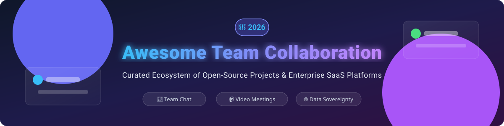

# 🚀 Awesome Team Collaboration 

  
  
  
  
  

---

## 💡 Overview & Ecosystem Insights

Welcome to the definitive, SEO-optimized curated list of **Team Collaboration Software**, **Open-Source Workspace Tools**, **Enterprise Chat Apps**, and **Video Conferencing Systems**. Whether you are looking for enterprise SaaS solutions or privacy-focused self-hosted team communication platforms, this repository provides deep insights into pricing, limits, market valuations, and GitHub star trends.

### 📊 SaaS Market Size & Industry Structure
> 📈 **Market Size & Valuation**: The global team collaboration software market is estimated at **$31.5 Billion USD in 2026** (projected to reach over $50B by 2030 at a CAGR of 13.2%).  
> 🏢 **Market Structure**: The sector is **moderately concentrated** at the top with tech giants (Microsoft, Alphabet, Cisco, Salesforce/Slack) dominating enterprise deployments (winner-takes-most market dynamics), while remaining **moderately fragmented** in niche verticals such as gaming communities (Discord), privacy/sovereignty compliance, and open-source self-hosted solutions.

---

## 📑 Table of Contents
- [🏢 Enterprise SaaS Platforms](#-enterprise-saas-platforms)
- [🔓 Open-Source GitHub Projects](#-open-source-github-projects)
- [🛠️ Key Features & Protocol Layer](#️-key-features--protocol-layer)
- [🤝 How to Contribute](#-how-to-contribute)
- [⚠️ Disclaimer](#️-disclaimer)
- [💖 Support & Sponsorship](#-support--sponsorship)
- [⭐ Star History](#-star-history)

---

## 🏢 Enterprise SaaS Platforms

Below is a comparative breakdown of top commercial team collaboration platforms, ordered by **Company Scale (Market Cap / Valuation in Descending Order)**.

| Platform | Company Valuation / Market Cap | Starting Tier Price | Free Tier Limit | Highlights & Key Features |
| :--- | :--- | :--- | :--- | :--- |
| **[Microsoft Teams](https://www.microsoft.com/microsoft-teams/)** | **~$3.1 Trillion USD** *(Microsoft)* | **$4.00** / user / mo | 60-min group meeting limit, 100 participants, 5 GB storage | Deep Microsoft 365 integration, audio calling, webinars, enterprise security compliance. |
| **[Google Meet](https://meet.google.com/)** | **~$2.1 Trillion USD** *(Alphabet)* | **$7.00** / user / mo | 60-min group meeting limit, 100 participants | Browser-based native WebRTC video conferencing bundled with Google Workspace productivity apps. |
| **[Webex](https://www.webex.com/)** | **~$195 Billion USD** *(Cisco)* | **$11.50** / user / mo | 40-min group meeting limit, 100 participants | Enterprise IP telephony, AI noise removal, high-compliance security for government & enterprise. |
| **[Slack](https://slack.com/)** | **~$175 Billion USD** *(Salesforce parent)* | **$7.25** / user / mo | 90-day message & file history limit, 10 app integrations, 1:1 huddles, 5 GB storage | Industry-standard channel messaging, 2,600+ app integrations, Slack Connect for inter-company chat. |
| **[Zoom](https://zoom.us/)** | **~$22 Billion USD** *(Zoom Video Communications)* | **$13.33** / user / mo | 40-min group meeting limit, 100 participants, 1-on-1 calls unlimited | HD video conferencing leader, Zoom Rooms, team chat, phone system, and AI Companion recaps. |
| **[Discord](https://discord.com/)** | **~$15 Billion USD** *(Private Valuation)* | **$2.99** / month *(Nitro Basic)* | Unlimited 25-person video calls, unlimited messaging, 10MB file uploads | Real-time voice channels, community servers, screen sharing, low-latency audio for gaming & dev communities. |
| **[RingCentral](https://www.ringcentral.com/)** | **~$3.2 Billion USD** *(RingCentral Inc.)* | **$20.00** / user / mo | No permanent free tier (14-day free trial, max 5 users) | Enterprise cloud PBX replacement, team messaging, HD video meetings, SMS, and global telephony. |
| **[Flock](https://flock.com/)** | **~$300 Million USD** *(Directi Group)* | **$4.50** / user / mo | 10,000 searchable message limit, 10 public channels, 5 GB total storage | Lightweight team chat, integrated task management, polls, notes, and video calling. |
| **[Chanty](https://www.chanty.com/)** | **~$15 Million USD** *(Private Valuation)* | **$3.00** / user / mo | Strict 5-user team cap, unlimited message history, 20 GB storage | Budget-friendly AI-powered team chat with Kanban task board and built-in voice/video calls. |

---

## 🔓 Open-Source GitHub Projects

Curated list of self-hosted open-source software for team communication, matrix federation, async messaging, and video conferencing. Ordered by **GitHub Stars (Descending)**.

| Project | GitHub Stars | License | Primary Use Case & Architectural Focus |
| :--- | :--- | :--- | :--- |
| **[AFFiNE](https://github.com/toeverything/AFFiNE)** |  | MIT | Hyper-fused canvas, docs, and team workspace block editor alternative to Notion & Miro. |
| **[AppFlowy](https://github.com/AppFlowy-IO/AppFlowy)** |  | AGPL-3.0 | Open-source Flutter-based workspace for wiki, notes, tasks, and team knowledge bases. |
| **[Plane](https://github.com/makeplane/plane)** |  | Apache-2.0 | Open-source project planning tool & team issue tracking workspace alternative to Jira & Linear. |
| **[Rocket.Chat](https://github.com/RocketChat/Rocket.Chat)** |  | MIT | Omnichannel customer support, enterprise team chat, Matrix federation, and VoIP integration. |
| **[Outline](https://github.com/outline/outline)** |  | BSL-1.1 | Fast, collaborative team knowledge base and wiki built with React and Node.js. |
| **[Nextcloud Talk](https://github.com/nextcloud/spreed)** |  | AGPL-3.0 | Self-hosted video conferencing, SIP bridge, and chat integrated into Nextcloud productivity suite. |
| **[Focalboard](https://github.com/mattermost-community/focalboard)** |  | MIT | Open-source Trello/Asana project management board integrated with Mattermost workspace. |
| **[Zulip](https://github.com/zulip/zulip)** |  | Apache-2.0 | Async-first team chat featuring real-time topic-based threading for distributed organizations. |
| **[Mattermost](https://github.com/mattermost/mattermost)** |  | MIT / AGPL | Premier open-source enterprise Slack alternative with SOC2/HIPAA compliance & DevOps workflow tooling. |
| **[Element (Matrix)](https://github.com/element-hq/element-web)** |  | Apache-2.0 | E2EE end-to-end encrypted decentralized client for the Matrix protocol used by military & sovereign govts. |
| **[BigBlueButton](https://github.com/bigbluebutton/bigbluebutton)** |  | LGPL-3.0 | Virtual classroom and web conferencing platform with multi-user whiteboard, polling, and breakout rooms. |
| **[Jitsi Meet](https://github.com/jitsi/jitsi-meet)** |  | Apache-2.0 | Fully encrypted, WebRTC-based video conferencing tool requiring no account registration. |
| **[Twake Workplace](https://github.com/linagora/twake-legacy)** |  | AGPL-3.0 | Sovereign European collaborative workplace suite with Matrix messaging, Drive, and OnlyOffice. |

---

## 🛠️ Key Features & Protocol Layer

### 🌐 The Matrix Protocol Layer
- **[Matrix Protocol Spec](https://github.com/matrix-org)** — Open standard for decentralized, end-to-end encrypted real-time communication.
- **Synapse** — Reference Matrix homeserver implementation in Python/Rust.
- **Dendrite** — Second-generation lightweight Matrix homeserver written in Go.
- **Conduit** — Ultra-lightweight, high-performance Matrix server written in Rust.

---

## 🤝 How to Contribute

1. Fork this repository 🍴
2. Create a new feature branch (`git checkout -b feature/awesome-tool`) 🌿
3. Add/edit entries in `README.md` following the standard table formats 📝
4. Submit a Pull Request with details 🚀

---

## ⚠️ Disclaimer

- This list is **community-curated** for educational, comparison, and architectural research purposes.
- All brand names, logos, product names, and company valuations belong to their respective corporate entities.
- Ensure proper security hardening, TLS/SRTP configuration, and data protection compliance (GDPR/HIPAA) when self-hosting open-source communication infrastructure.

---

## 💖 Support & Sponsorship

Thank you so much for using and exploring **Awesome Team Collaboration**! 🌟

If you find this repository helpful for your research, team, or project setup, please consider:
- ⭐ **Starring** this repository on GitHub to show your support.
- 🍴 **Forking** and sharing it with your colleagues and network.
- ☕ **Buying me a coffee** or sponsoring ongoing maintenance via [GitHub Sponsors](https://github.com/sponsors/ishandutta2007).

Your support is deeply appreciated and fuels further open-source research! 🙌

---

## ⭐ Star History

